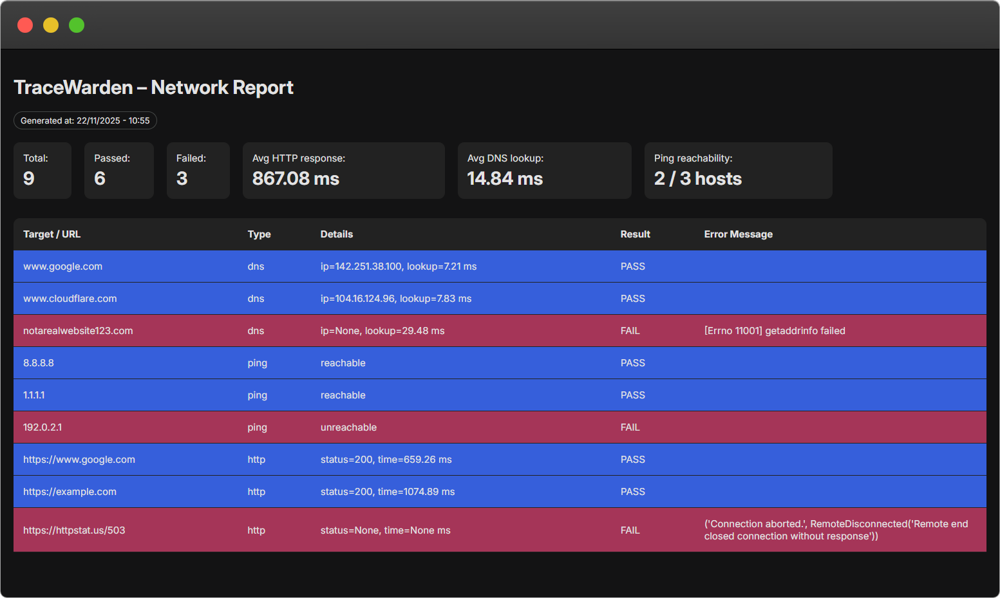

# TraceWarden



TraceWarden is a simple network diagnostics tool written in Python for educational purposes. It runs a set of connectivity checks (HTTP, DNS, and Ping) based on a JSON configuration file.

## Features

- **HTTP checks**  
  Validates that endpoints respond successfully and within a basic performance threshold.

- **DNS resolution checks**  
  Measures DNS lookup time and verifies hostname resolution.

- **Ping connectivity checks**  
  Confirms reachable hosts (simple pass/fail availability).

- **Config-driven tests**  
  Modify `config.json` to add or remove network checks.

- **HTML and JSON reports**  
  Easy to review visually or feed into automation tooling.

## Requirements

- Python 3.10 or newer
- `requests` Python package

Install dependencies:

```bash
pip install -r requirements.txt
```

## Usage
1. Edit the test configuration in config.json if needed.

2. Run the tool:
```bash
python twarden.py
```
3. Output files will be generated in the project folder:

   - report.html — visual summary of results.
   - results.json — structured log for automation.

  ## Configuration

  Example test entry:
```JSON
{
  "id": "http_google",
  "type": "http",
  "url": "https://www.google.com",
  "expected_status": 200,
  "max_response_ms": 1500
}
```

Supported test types:

- `http` — requires url
- `dns` — requires hostname
- `ping` — requires target (IP or hostname)

You can mix multiple checks in a single config file.
